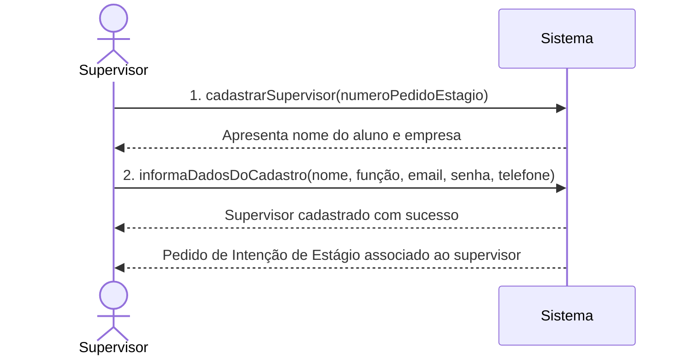
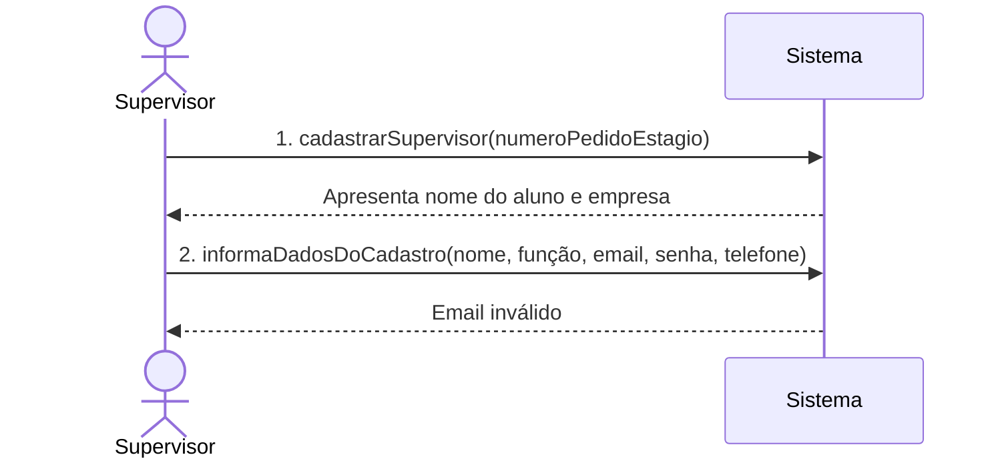
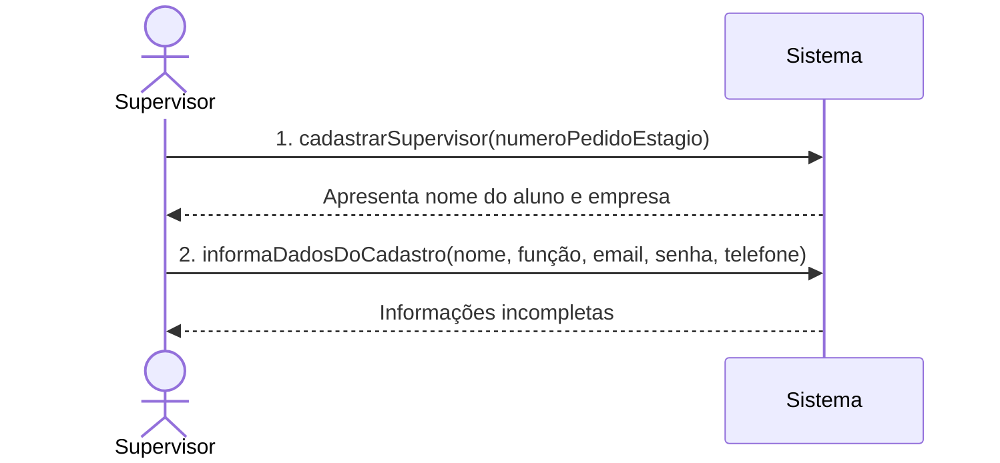
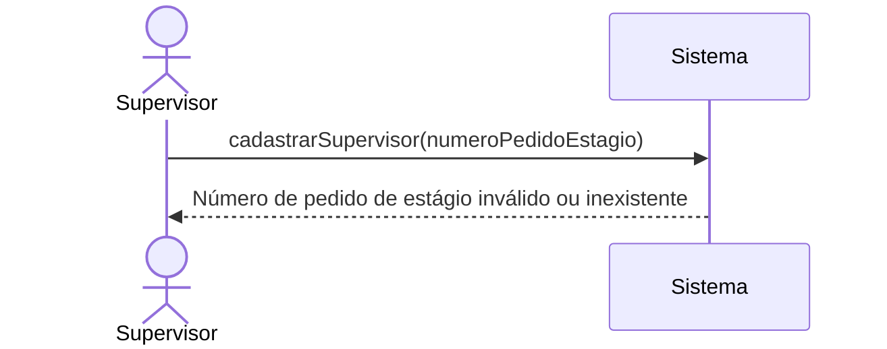
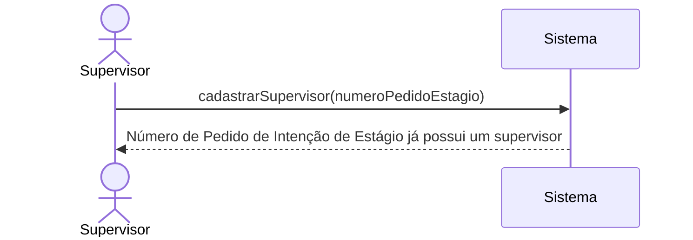

# Diagrama de Sequência do Sistema
## Caso de Uso UC3 - Criar um Supervisor

### Fluxo principal

### Fluxo alternativo 1 - Email inválido

### Fluxo alternativo 2 - O supervisor insere informações incompletas

### Fluxo alternativo 3 - Número de pedido de estágio inválido ou inexistente

### Fluxo alternativo 4 - Número de Pedido de Intenção de Estágio já possui um supervisor

#### Perguntas:

- É necessário referenciar o passo que o fluxo alternativo deve voltar?