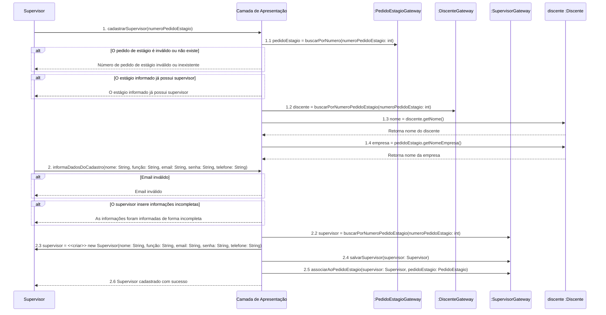
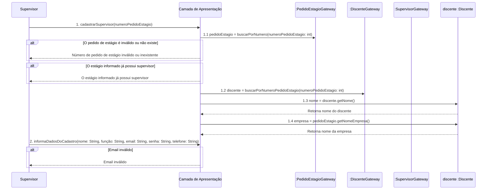
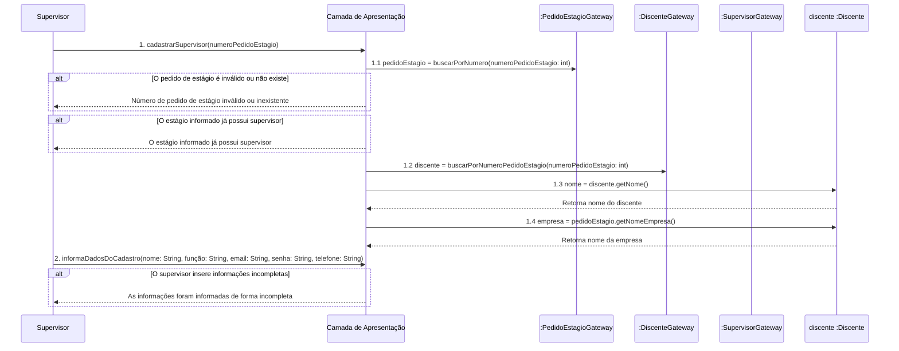
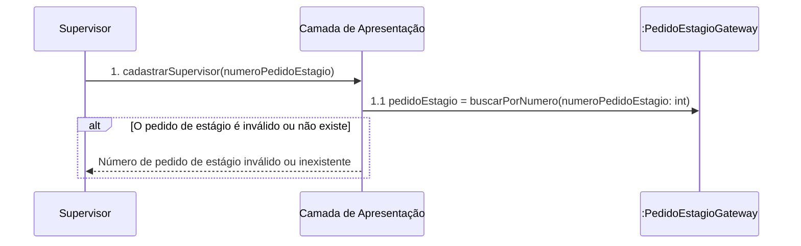
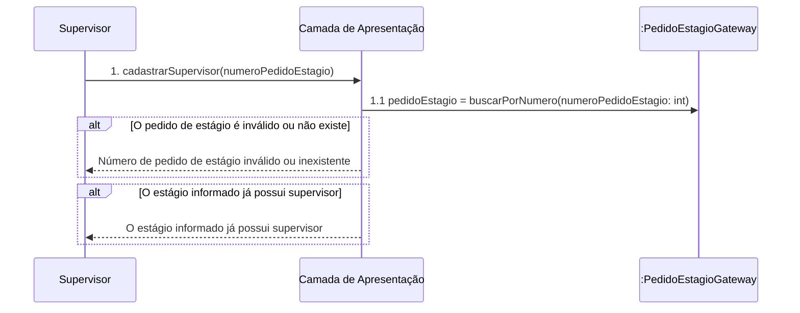

# Diagrama de Sequência
## Caso de Uso UC3 - Criar um Supervisor

### Fluxo principal

### Fluxo alternativo 1 - Email inválido

### Fluxo alternativo 2 - O supervisor insere informações incompletas

### Fluxo alternativo 3 - Número de pedido de estágio inválido ou inexistente

### Fluxo alternativo 4 - Número de Pedido de Intenção de Estágio já possui um supervisor

#### Dúvidas

- No fluxo alternativo, é pra reescrever o fluxo principal adicionando o que acontece no fluxo alternativo? Precisamos incluir o que acontece nos fluxos alternativos anteriores a "ação principal" do fluxo alternativo atual?
- Está em um bom formato?
- Está claro?