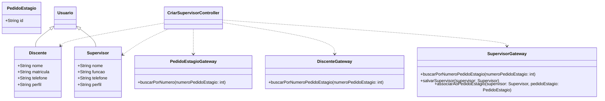

# Diagrama de Classes (VCP)
## Caso de Uso UC3 - Criar um Supervisor

```mermaid
classDiagram
    class Discente {
        +String nome
        +String matricula
        +String telefone
        +String perfil
    }

    class Supervisor {
        +String nome
        +String funcao
        +String telefone
        +String perfil
    }

    class PedidoEstagio {
        +String id
    }

    class PedidoEstagioGateway {
        +buscarPorNumero(numeroPedidoEstagio: int)
    }

    class DiscenteGateway {
        +buscarPorNumeroPedidoEstagio(numeroPedidoEstagio: int)
    }

    class SupervisorGateway {
        +buscarPorNumeroPedidoEstagio(numeroPedidoEstagio: int)
        +salvarSupervisor(supervisor: Supervisor)
        +associarAoPedidoEstagio(supervisor: Supervisor, pedidoEstagio: PedidoEstagio)
    }

    Usuario <|-- Discente
    Usuario <|-- Supervisor

    CriarSupervisorController ..> PedidoEstagioGateway
    CriarSupervisorController ..> DiscenteGateway
    CriarSupervisorController ..> SupervisorGateway

    CriarSupervisorController ..> Discente
    CriarSupervisorController ..> Supervisor
```