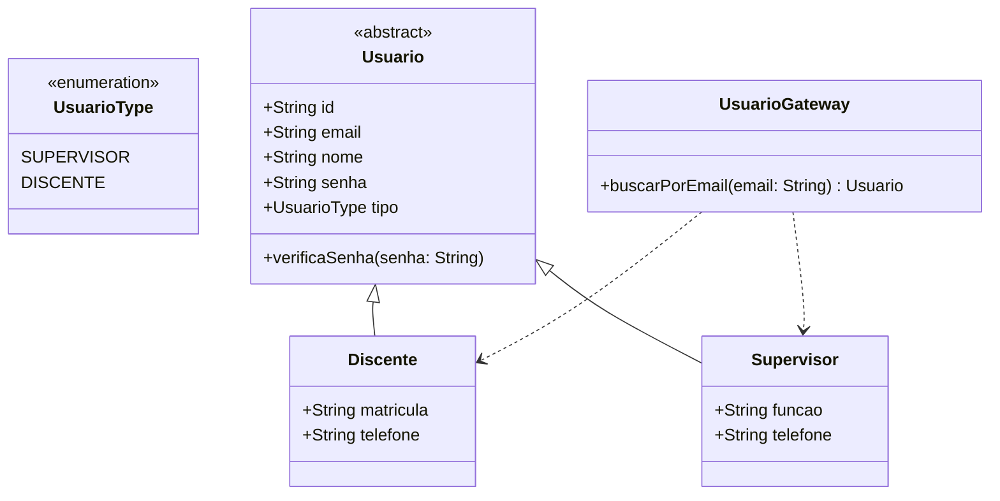

# Diagrama de Classes (VCP)
## Caso de Uso UC4 - Identificar Usuário

```mermaid
classDiagram

    class UsuarioType {
        <<enumeration>>

        SUPERVISOR
        DISCENTE        
    }

    class Usuario {
        <<abstract>>

        +String id

        +String email
        +String nome
        +String senha
        +UsuarioType tipo

        +verificaSenha(senha: String)
    }

    class Discente {
        +String matricula
        +String telefone
    }

    class Supervisor {
        +String funcao
        +String telefone
    }

    class UsuarioGateway {
        +buscarPorEmail(email: String) Usuario
    }

    Usuario <|-- Discente
    Usuario <|-- Supervisor

    UsuarioGateway ..> Supervisor
    UsuarioGateway ..> Discente

```