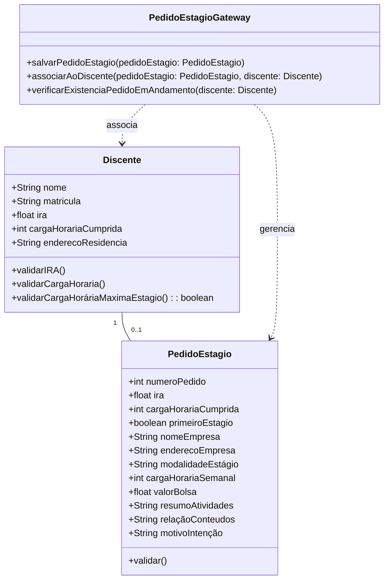

# Diagrama de Classes (VCP)
## Caso de Uso UC5 - Cadastrar Supervisor

```mermaid
classDiagram
    class Discente {
        +String nome
        +String matricula
        +float ira
        +int cargaHorariaCumprida
        +String enderecoResidencia
        +validarIRA()
        +validarCargaHoraria()
        +validarCargaHoráriaMaximaEstagio(): boolean
    }

    class PedidoEstagio {
        +int numeroPedido
        +float ira
        +int cargaHorariaCumprida
        +boolean primeiroEstagio
        +String nomeEmpresa
        +String enderecoEmpresa
        +String modalidadeEstágio
        +int cargaHorariaSemanal
        +float valorBolsa
        +String resumoAtividades
        +String relaçãoConteudos
        +String motivoIntenção
        +validar()
    }

    class PedidoEstagioGateway {
        +salvarPedidoEstagio(pedidoEstagio: PedidoEstagio)
        +associarAoDiscente(pedidoEstagio: PedidoEstagio, discente: Discente)
        +verificarExistenciaPedidoEmAndamento(discente: Discente)
    }

    Discente "1" -- "0..1" PedidoEstagio
    PedidoEstagioGateway ..> PedidoEstagio : gerencia
    PedidoEstagioGateway ..> Discente : associa
```